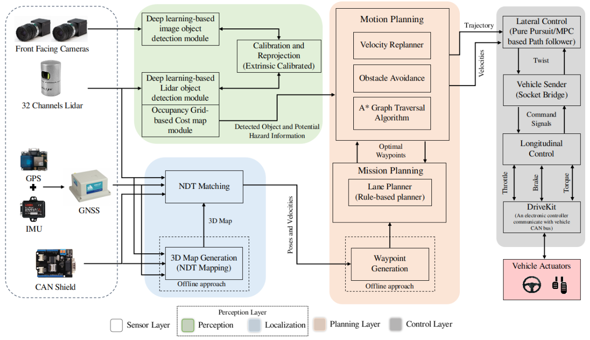
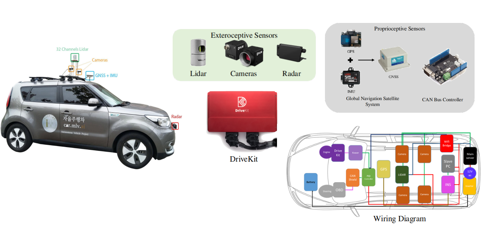
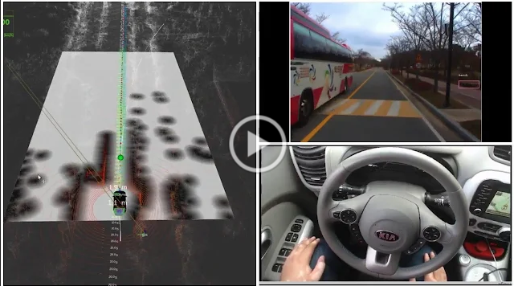
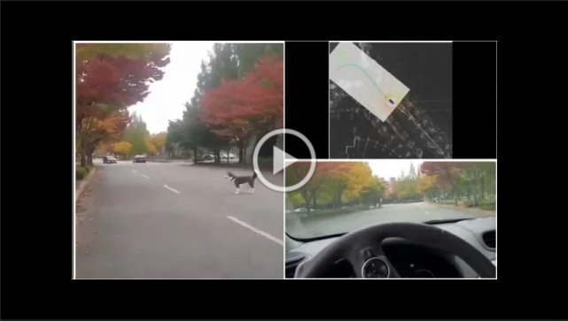
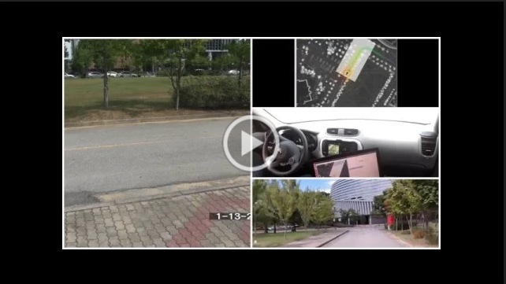
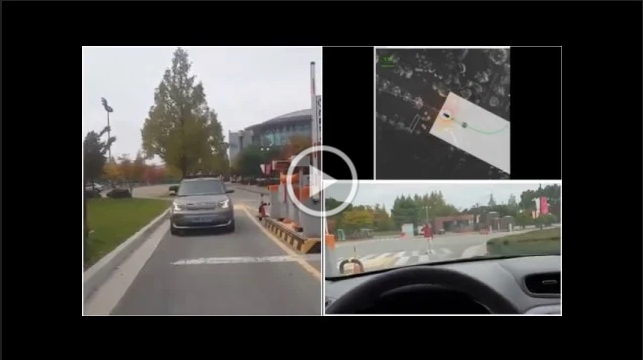
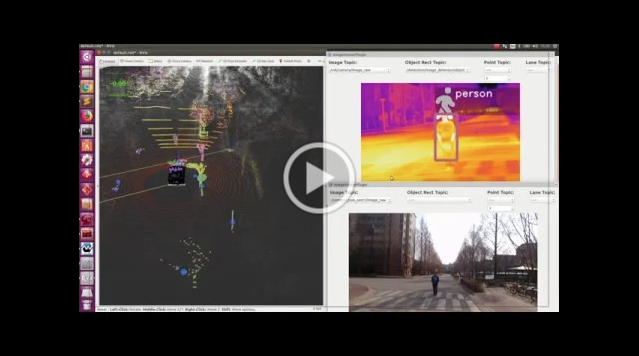
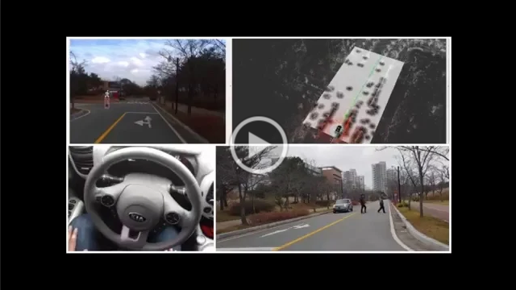

## About Me

I am a PostDoctorate Researcher at MLV, EECS, GIST. I work on the autonomous vehicle to make it socially acceptable and operate it with minimal sensor suite. I have worked on a complete end-to-end suite of the autonomous vehicle from mapping, localization, perception, planning and control. My research interests include deep learning, autonomous driving, sensorimotor learning, and representation learning. I finished my PhD at Machine Learning and Vision Lab at Gwangju Institute of Science and Technology, where I worked under the supervision [Prof.Moongu Jeon](https://sites.google.com/view/mlv/people/professor). My PhD Thesis was titled ["Deep Neural Networks for Understanding Autonomous Vehicle Behavior and Control"](https://library.gist.ac.kr/#/librarySearchDetails?book_no=467171).

<!-- ## Research Interests

- **Computer Vision:** image recognition, image generation, video captioning
- **Machine Learning:** meta-learning, incremental learning, transfer learning -->

## News
- **[March 2022]** Our paper Exploring Thermal Images for Object Detection in Underexposure Regions for Autonomous Driving is accepted to Applied Soft Computing (IF: 6.725).
- **[March 2022]** Our paper Drivable Region Estimation for Self-Driving Vehicles Using Radar is accepted to IEEE Transactions on Vehicular Technology (IF:5.978).
- **[Nov 2021]** Our paper ARTSeg: Employing Attention for Thermal images Semantic Segmentation is accepted to [ACPR 2021](http://brain.korea.ac.kr/acpr/).
- **[June 2021]** Our paper SSTN: Self-Supervised Domain Adaptation Thermal Object Detection for Autonomous Driving is accepted to [IROS 2021](https://www.iros2021.org/).
- **[June 2021]** Our paper LDNet: End-to-End Lane Marking Detection Approach using a Dynamic Vision Sensor is accepted to IEEE Transactions on Intelligent Transportation Systems (IF:6.492).
- **[May 2021]** Our paper Key Points Estimation and Point Instance Segmentation Approach for Lane Detection is accepted to IEEE Transactions on Intelligent Transportation Systems (IF:6.492).
- **[April 2021]** Our paper Channel Boosting Feature Ensemble for Radar-based Object Detection is accepted to [IV 2021](https://2021.ieee-iv.org/).
- **[Jan. 2021]** Our N2C: Neural Network Controller Design Using Behavioral Cloning is accepted to IEEE Transactions on Intelligent Transportation Systems (IF:6.492).

## Publications

- **Exploring Thermal Images for Object Detection in Underexposure Regions for Autonomous Driving**
   
  F. Munir, **Shoaib Azam**, M.A. Rafique, A.M. Sheri, M. Jeon and W. Pedrycz
   
  Applied Soft Computing, Elsevier. **ASOC 2022**.
   

- **Drivable Region Estimation for Self-Driving Vehicles Using Radar**
   
  MI. Hussain, **Shoaib Azam**, A. Rafiq, AM. Sheri and M. Jeon
   
  IEEE Transactions on Vehicular Technology. **T-VT 2022**.
   
  [[PDF](https://ieeexplore.ieee.org/stamp/stamp.jsp?tp=&arnumber=9740418)]
  
- **LDNet: End-to-End Lane Marking Detection Approach using a Dynamic Vision Sensor**
   
  Farzeen Munir, **Shoaib Azam**, Moongu Jeon, Byung-Geun Lee and Witold Pedrycz
   
  IEEE Transactions on Intelligent Transportation Systems. **T-ITS 2021** (**Accepted**).
   
  <!-- [[PDF](https://arxiv.org/pdf/2009.08020.pdf)] [[Code](https://github.com/yaoyao-liu/mnemonics)] <strong><i style="color:#e74d3c">Oral Presentation</i></strong> -->

- **Key Points Estimation and Point Instance Segmentation Approach for Lane Detection**
   
  Yeongmin Ko,  Younkwan Lee,  **Shoaib Azam**, Farzeen Munir, Moongu Jeon and Witold Pedrycz
   
  IEEE Transactions on Intelligent Transportation Systems. **T-ITS 2021**.
   
  [[PDF](https://ieeexplore.ieee.org/stamp/stamp.jsp?tp=&arnumber=9460822)] [[Code](https://github.com/koyeongmin/PINet_new)]

- **N2C: Neural Network Controller Design Using Behavioral Cloning**
   
  **Shoaib Azam**, Farzeen Munir, M Aasim Rafique, A.M Sheri, M.I Hussain and Moongu Jeon
   
  IEEE Transactions on Intelligent Transportation Systems. **T-ITS 2021**.
   
  [[PDF](https://ieeexplore.ieee.org/stamp/stamp.jsp?tp=&arnumber=9312433)]

- **System, Design and Experimental Validation of Autonomous Vehicle in an Unconstrained Environment**
   
  **Shoaib Azam**, Farzeen Munir, A.M Sheri, J.Kim and Moongu Jeon
   
  Sensors. **Sensors 2020**.
   
  [[PDF](https://doi.org/10.3390/s20215999)] 

- **Transfer Learning for Vehicle Detection Using Two Cameras with Different Focal Lengths**
   
  Vinh Quang Dinh, Farzeen Munir, **Shoaib Azam**, Kin-Choong Yow  and Moongu Jeon
   
   Information Sciences. **Inf.Sci 2020**.
   
  [[PDF](https://doi.org/10.1016/j.ins.2019.11.034)]

- **Saliency Based Object Detection and Enhancements Using Spectral Residual Approach in Static Images and Videos**
   
  **Shoaib Azam**, Syed Omer Gilani, Mohsin Jamil, Yasar Ayaz, Muhammad Naveed, and Muhammad Nasir Khan
   
  Advanced Science Letters. **Adv.Sci.Lett 2015**.
   

- **ARTSeg: Employing Attention for Thermal images Semantic Segmentation**
   
  Farzeen Munir, **Shoaib Azam**, Unse Fatima, and Moongu Jeon
   
  Asian Conference on Pattern Recognition (ACPR). **ACPR 2021**.
   

- **SSTN: Self-Supervised Domain Adaptation Thermal Object Detection for Autonomous Driving**
   
  Farzeen Munir, **Shoaib Azam** and Moongu Jeon
   
  IEEE/RSJ International Conference on Intelligent Robots and Systems. **IROS 2021**.
   
  [[PDF](https://arxiv.org/pdf/2103.03150.pdf)]

- **Channel Boosting Feature Ensemble for Radar-based Object Detection**
   
  **Shoaib Azam**, Farzeen Munir, and Moongu Jeon
   
  IEEE Intelligent Vehicles Symposium. **IV 2021**.
   
  [[PDF](https://arxiv.org/pdf/2101.03531.pdf)]

- **Visuomotor Steering angle Prediction in Dynamic Perception Environment for Autonomous Vehicle**
   
  Farzeen Munir, **Shoaib Azam** and Moongu Jeon
   
  IEEE International Conference On Consumer Electronics. **ICCE-Asia 2020**.
   
  [[PDF](https://ieeexplore.ieee.org/stamp/stamp.jsp?tp=&arnumber=9276907)]

- **Multiple Objects Tracking using Radar for Autonomous Driving**
   
  Muhamamd Ishfaq Hussain, **Shoaib Azam**, Farzeen Munir, Zafran Khan, and Moongu Jeon
   
  IEEE International IOT, Electronics and Mechatronics Conference. **IEMTRONICS 2020**.
   
  [[PDF](https://arxiv.org/pdf/2103.03150.pdf)]

- **Dynamic Control System Design for Autonomous Car**
   
  **Shoaib Azam**, Farzeen Munir, and Moongu Jeon
   
  International Conference on Vehicle Technology and Intelligent Transportation Systems. **VEHITS 2020**.
   
  [[PDF](https://www.scitepress.org/Papers/2020/93929/93929.pdf)]

- **Automated Taxi Booking Operations for Autonomous Vehicles**
   
  Linh Van Ma, **Shoaib Azam**, Farzeen Munir, Jinho Choi and, Moongu Jeon
   
  IEEE International Conference on Signal Processing and Communication Systems. **ICSPCS 2019**.
   
  [[PDF](https://arxiv.org/pdf/2103.03150.pdf)]

- **Data fusion of Lidar and Thermal Camera for Autonomous driving**
   
  **Shoaib Azam**, Farzeen Munir, Ahmad Muqeem Sheri, Ishfaq Hussain, YeongMin Ko and Moongu Jeon
   
  Applied Industrial Optics Meeting. **AIO 2019**.
   
  [[PDF](https://www.osapublishing.org/view_article.cfm?gotourl=https%3A%2F%2Fwww%2Eosapublishing%2Eorg%2FDirectPDFAccess%2FC04FA570%2D3F77%2D48BD%2DA51A78BFCB93A47F%5F414953%2FAIO%2D2019%2DT2A%2E5%2Epdf%3Fda%3D1%26id%3D414953%26uri%3DAIO%2D2019%2DT2A%2E5%26seq%3D0%26mobile%3Dno&org=Gwangju%20Institute%20of%20Science%20and%20Technology%20Library%20%2D%20GIST)]

- **Where Am I: Localization and 3D Maps for Autonomous Vehicles**
   
  Farzeen Munir, **Shoaib Azam**, Ahmad Muqeem Sheri, YeongMin Ko and Moongu Jeon
   
  International Conference on Vehicle Technology and Intelligent Transportation Systems. **VEHITS 2019**.
   
  [[PDF](http://www.scitepress.org/Papers/2019/77184/77184.pdf)]

- **Autonomous Vehicle: The Architectural Aspect of Self Driving Car**
   
  Farzeen Munir, **Shoaib Azam**, Ishfaq Hussain, Ahmad Muqeem Sheri, and Moongu Jeon
   
  Sensors, Signal and Image Processing. **SSIP 2018**.
   
  [[PDF](https://dl.acm.org/doi/10.1145/3290589.3290599)]

- **Object Modeling from 3D Point Cloud Data for Self-Driving Vehicles**
   
  **Shoaib Azam**, Farzeen Munir, Aasim Rafique, YeongMin Ko, Ahmad Muqeem Sheri and Moongu Jeon
   
  IEEE Intelligent Vehicles Symposium. **IV 2018**.
   
  [[PDF](https://ieeexplore.ieee.org/stamp/stamp.jsp?tp=&arnumber=8500500)]

- **Vehicle Pose Detection Using Region Based Convolutional Neural Network**
   
  **Shoaib Azam**, Aasim Rafique, Moongu Jeon
   
  The International Conference on Control Automation & Information Science. **ICCAIS 2016**.
   
  [[PDF](https://ieeexplore.ieee.org/stamp/stamp.jsp?tp=&arnumber=7822459)]

- **A Benchmark of Computational Models of Saliency to Predict Human Fixations in Videos**
   
  **Shoaib Azam**, Syed Omer Gilani, Moongu Jeon, Rehan Yousaf, and Jeong-Bae Kim
   
  International Joint Conference on Computer Vision, Imaging and Computer Graphics Theory and Applications. **VISGRAPP 2016**.
   
  [[PDF](https://www.scitepress.org/Papers/2016/56787/pdf/index.html)]

- **Face-deidentification in images using restricted boltzmann machines**
   
  Rafique, M. Aasim, **Shoaib Azam**, Moongu Jeon, and Sangwook Lee
   
  International Conference for Internet Technology and Secured Transactions. **ICITST 2016**.
   
  [[PDF](https://ieeexplore.ieee.org/stamp/stamp.jsp?tp=&arnumber=7856669)]

- **Single object tracking system using fast compressive tracking**
   
  Tahir, Abdullah, **Shoaib Azam**, Sujani Sagabala, Moongu Jeon, and Ryu Jeha
   
  IEEE International Conference on Consumer Electronics. **ICCE-Asia 2016**.
   
  [[PDF](https://ieeexplore.ieee.org/stamp/stamp.jsp?tp=&arnumber=7804760)]

## Patent
- **얼굴 비식별화 방법 (Translated:"Face de-identification method"), 국내 출원 번호 : 2017-0032265, 출원일자 : 2017.03.15, 등록번호 : 10-1861520**
 
Rafique Muhammad Aasim, **Azam Muhammad Shoaib**, 최인문 (InMoon Choi), 전문구 (Moongu Jeon)
 

## Reviewer Activity
- International Workshop on Assistive Computer Vision and Robotics, (ICCV), 2021
- IEEE Transactions on Intelligent Transportation Systems (IV) , 2021
- European Conference on Computer Vision (ECCV), 2020
- IEEE Transactions on Intelligent Transportation Systems (IV) , 2020
- IEEE Intelligent Transportation System Conference (ITSC), 2020
- IEEE Transaction of Intelligent Transportation Systems (T-ITS), 2020

## Research Project

- **Developement of Autonomous vehicle (Supported by: GIST)**
  - Architecture
    
  - Sensor Suite 
    
  - Demostrations
    - Complete autonomous drive
    
    - Demo of Obstacle Avoidance
    
    - Demo of Obstacle Stopping
    
    - Demo of Obstacle Stopping at the Entrance or Exit Gate Barrier
    
    - Demo of Obstacle Detection using RGB and Thermal Camera and Projection in the Lidar Frame
    
    - Demo of Obstacle Stopping upon detection pedestrain
    
